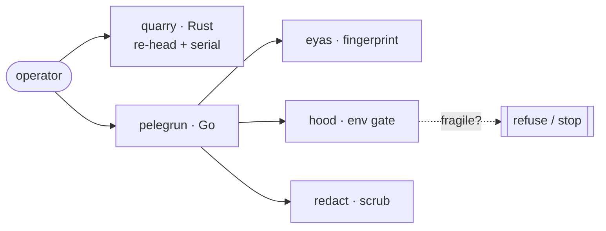

<div align="center">

# Pelegrún · ap-hk07 firmware tools

No-brick toolkit to cross-flash and recover **EnGenius/Senao ap-hk07** access
points (EWS377AP v3 · EWS377-FIT · ECW230v3 · IPQ807x) over the network — no
UART required. One-field firmware re-head, Code27 serial provisioning,
bootloader env safety gate, and firmware family fingerprinting. Rust + Go.

[](LICENSE)
[-informational.svg)](Makefile)
[](https://github.com/ParkWardRR/pelegrun-ap-hk07-firmware-tools/releases)
[](SAFETY.md)


<br/>


<br/>

[](https://github.com/charmbracelet/bubbletea)

</div>

### TUI screenshots

<table>
<tr>
<td></td>
<td></td>
</tr>
<tr>
<td></td>
<td></td>
</tr>
</table>

<details>
<summary>All 7 TUI screens</summary>

| Step | Screen | What it does |
|------|--------|--------------|
| 1 | Discover | Fingerprints the firmware family (Cloud · EWS/LuCI · FIT) |
| 2 | Connect | How to reach each family — SSH on **:8822**, not 22 |
| 3 | Back Up | Required read-only evidence bundle before flashing |
| 4 | Safeguards | Why the tool can't brick: append-only env gate |
| 5 | Identity | Mint a unique, collision-checked serial |
| 6 | Install | No-UART A/B flash: write the spare slot, reboot |
| 7 | Verify | Confirm the device came back as intended |

Navigate `↑↓` / `jk`, jump `g`/`G`, quit `q`.

</details>

---

> **Cross-flashing can brick hardware.** Pelegrún is designed so the common
> mistakes aren't reachable (see [the two invariants](#the-two-invariants)), but
> firmware work is never zero-risk. Read [`SAFETY.md`](SAFETY.md) and the
> [scope/legal](#scope--legal) notes first. Unofficial — not affiliated with
> EnGenius or Senao. For hardware you own.

## Why

The EWS377AP v3, EWS377-FIT, and ECW230v3 are the **same board** (Qualcomm
IPQ807x, Senao `ap-hk07`). Cross-flashing between them requires changing one
4-byte header field (`product_id`). But the manual path is easy to get wrong: a
stray `setconfig` wipes the bootloader env, a hand-rebuilt env bricks the boot
slot, SSH is on **port 8822**, and adoption fails silently on a blank serial.
Pelegrún encodes the safe path so those mistakes aren't reachable.

**The entire conversion is network-only** — SSH to set the serial, then upload
the patched image via the web GUI. No UART, no physical access needed.

## The two invariants

Two rules keep a failed flash recoverable over the network:

1. **Writes go to the `INACTIVE` A/B slot.** The working slot stays bootable — a
   bad image is undone with a factory-reset hold.
2. **The bootloader env is `APPEND-ONLY`.** The tool only adds single fields to an
   env it has *verified complete*; it **cannot** erase it or save a partial one.

**When UART *is* required:** only when the network path is already gone — a
wiped bootloader env, a rootfs that won't boot, or a first flash of an unproven
model as a safety net.

## Quick start

```console
# Patch an ECW230v3 image to flash from EWS firmware (product_id 284 → 282)
$ quarry rehead ecw230v3-v1.8.114-1.bin patched.bin --to 282

# Inspect any Senao image header
$ quarry inspect patched.bin

# Generate a unique serial and snextra for the target model
$ quarry serial  --model X42 --prefix EPC1 --suffix 0001
$ quarry snextra --model X42 --prefix EPC1

# Fingerprint what firmware an AP is running
$ pelegrun discover http://192.168.1.1

# Check bootloader env safety before writing
$ pelegrun envcheck env-dump.txt

# Scrub secrets before sharing a log
$ pelegrun redact bundle.txt --mac --value <serial>

# Launch the TUI dashboard
$ pelegrun
```

**Product ids:** `282` EWS377AP v3 · `300` EWS377-FIT · `284` ECW230v3 · `275` ECW230 · `182` EWS377AP v2 · `285` ECW230S.
**Model codes:** `X44` EWS377AP v3 · `X45` EWS377-FIT · `X42` ECW230v3.
`hw_id` in the u-boot env (e.g. `0101012B` on the FIT: vendor `0x0101` + `0x012B`=299) is a
*different* number from the header `product_id` (300) — see
[`docs/USAGE.md`](docs/USAGE.md#hw_id-vs-product_id-open-data-request-8).

## Install

Download a prebuilt binary from the
[latest release](https://github.com/ParkWardRR/pelegrun-ap-hk07-firmware-tools/releases/latest)
and **verify the checksum**:

```console
$ curl -LO .../releases/latest/download/pelegrun-linux-amd64
$ curl -LO .../releases/latest/download/SHA256SUMS
$ sha256sum -c SHA256SUMS --ignore-missing && chmod +x pelegrun-linux-amd64
```

From source: `cargo build --release -p quarry` (Rust) and `cd go && go build ./cmd/pelegrun` (Go).

## Architecture



| Component | Role | Lang |
|---|---|---|
| **quarry** | Image header re-head, Code27 serial, snextra, inspect | Rust |
| **pelegrun** | TUI dashboard + CLI subcommands | Go |
| **eyas** | Fingerprint firmware family (Cloud · EWS/LuCI · FIT) | Go |
| **hood** | Bootloader env completeness gate | Go |
| **redact** | Secret scrubbing for logs and support bundles | Go |
| **band** | Code27 serial math (Go port of quarry's serial module) | Go |

## OpenWrt

For running **OpenWrt** on the EWS377AP v3, see the dedicated repo:
**[ews377apv3-openwrt](https://github.com/ParkWardRR/ews377apv3-openwrt)** —
porting plan, install guide, hardware reference, and community builds.

## Build & test

CI is **local only** — no GitHub Actions. `make` drives both languages:

```console
make ci            # fmt-check + lint + tests (race)
make test          # cargo test + go test
make dist          # cross-compiled binaries + SHA256SUMS → dist/
make tui           # run the dashboard
```

Run `make hooks` once per clone to gate `git push` on a green `make ci`.

## Scope & legal

Unofficial community tooling for **interoperability and self-hosting on hardware
you own**. "EnGenius" and "Senao" are trademarks of their owners, used only to
name the affected products; no endorsement or affiliation is implied. **No vendor
firmware is redistributed here** — you supply your own images. Do not use this for
warranty fraud, evading paid licensing on hardware you don't own, or defeating
theft protection. Cross-flashing/synthetic serials are unsupported and may void
warranty/support. No warranty; use at your own risk. See [`SAFETY.md`](SAFETY.md).

## Credits

Born from a real cross-flash + recovery saga documented in the
[engenius-field-guide](https://github.com/ParkWardRR/engenius-field-guide),
building on [DaveCorder's EnGenius notes](https://github.com/DaveCorder/EnGenius).
TUI by [Bubble Tea](https://github.com/charmbracelet/bubbletea).

## License

[Blue Oak Model License 1.0.0](LICENSE).
